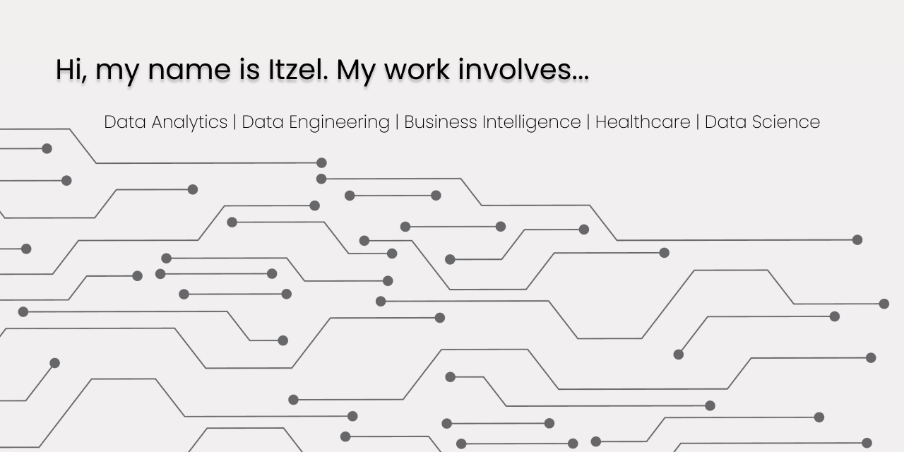
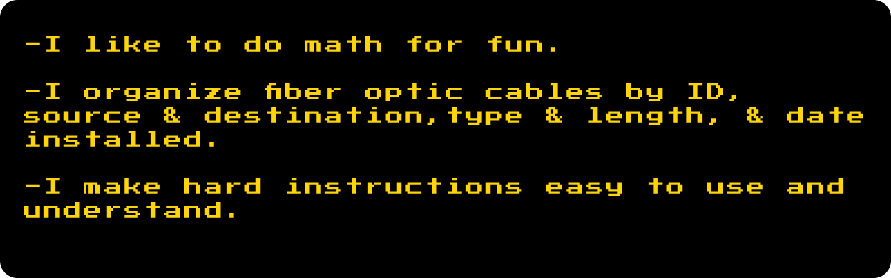

<!--

A working girl deserves a cup of java...and new ethernet cables.

<!-- ✨ Header / Intro -->

<!--

 -->

<!--

-->

###  Tech Stack

  
  
  
   
  
  
 

<!-- Core Technologies -->

  

  

  

  

  

  

  

  

  

  

  

---

### Current Projects
- **Project One** — description one
- **Project Two** — description two
- **Project Three** — description three

---

### Connect With Me

  
 <!--  -->

